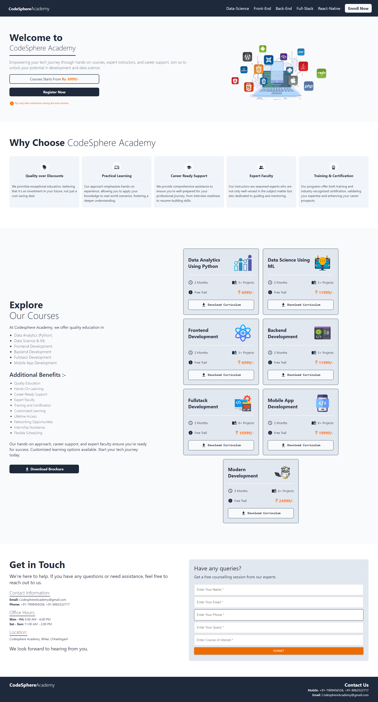

# Codesphere Academy

## [Visit Website Here..](https://codesphere-academy.vercel.app/)

Welcome to **Codesphere Academy**, your go-to platform for mastering the latest technologies through our comprehensive live courses. We are dedicated to providing quality education to help you excel in the tech industry.

## Our Courses

### Data Analytics (Python)

Unlock the power of data with our **Data Analytics** course. Learn how to analyze, visualize, and make sense of complex datasets using Python. This course covers:

- Python programming fundamentals
- Data manipulation with Pandas
- Data visualization with Matplotlib and Seaborn
- Statistical analysis and interpretation

### Data Science & Machine Learning

Dive into the world of **Data Science & Machine Learning**. This course will guide you through:

- Data preprocessing and cleaning
- Exploratory data analysis
- Machine learning algorithms
- Model evaluation and deployment
- Tools: Scikit-learn, TensorFlow, Keras

### Frontend Development

Become a frontend expert with our **Frontend Development** course. You'll learn to create stunning, responsive websites using:

- HTML, CSS, and JavaScript
- Frameworks: React, Angular, Vue.js
- Responsive design principles
- Version control with Git

### Backend Development

Master the server-side with our **Backend Development** course. This course covers:

- Node.js and Express
- Database management with SQL and NoSQL (MongoDB)
- API development and RESTful services
- Authentication and security practices

### Fullstack Development

Combine your frontend and backend skills with our **Fullstack Development** course. Topics include:

- MERN stack (MongoDB, Express, React, Node.js)
- CRUD operations
- Deployment and CI/CD
- Building scalable web applications

### Mobile App Development

Enter the world of mobile apps with our **Mobile App Development** course. Learn to build apps for both Android and iOS using:

- React Native
- Flutter
- App deployment on Google Play Store and Apple App Store
- Mobile UI/UX design

## Why Choose Codesphere Academy?

- **Live Courses:** Interactive sessions with experienced instructors.
- **Hands-on Projects:** Practical experience with real-world projects.
- **Community Support:** Join a vibrant community of learners and professionals.
- **Career Guidance:** Get personalized advice to advance your tech career.

## Get Started

Ready to start your learning journey? [Sign up](https://codesphere-academy.vercel.app/) for a course today and take the first step towards achieving your tech goals.

For more information, visit our [website](https://codesphere-academy.vercel.app/) or contact us at [codesphereacademy@gmail.com](mailto:codesphereacademy@gmail.com).

---

Stay connected with us on [Facebook](https://codesphere-academy.vercel.app/), [Twitter](https://codesphere-academy.vercel.app/), and [LinkedIn](https://codesphere-academy.vercel.app/).

© 2024 Codesphere Academy. All rights reserved.
